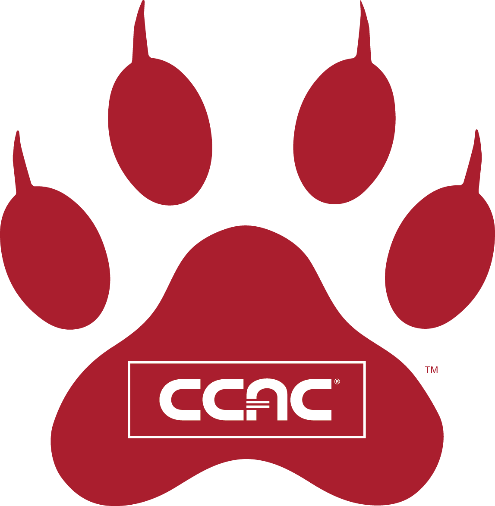

[![Apple-Silicon-Shield]][Apple-Silicon-Shield-url]
[![MIT License][license-shield]][license-url]

[![LinkedIn][linkedin-shield]][linkedin-url]
[![GitHub][GitHub-shield]][GitHub-url]

<!-- PROJECT LOGO -->
 

  

  <h3 align="center">BlazeWheeler/Android-Projects/CIT-245</h3>

  

    Repository of Android Programming Challenges
     
    

<!-- ABOUT THE PROJECT -->
## About The Repository
Welcome to My Android Projects!

This repository contains a collection of programming challenges designed to test and improve the skills of developers. The challenges are focused on Java, the primary programming language used in Android development.
 

This repository contains a collection of programming challenges from Android&trade; Boot Camp For Developers Using JAVA&trade; by Corinne Hoisington
  

"This course is an introduction to creating software applications (apps) using an Object-Oriented Programming (OOP) language and the Android operating system.  The focus of the course includes the Integrated Development Environment (IDE) and Software Development Kit (SDK) technologies, Graphical User Interfaces (GUI), program design and control structures, interactive activity classes and the activity life cycle, multimedia applications, database technology and Web application publishing." - The Community College of Allegheny County&trade;

 Happy coding!

<!-- Change  -->

(<a href="#readme-top">back to top</a>)

### Technologies

Technologies used in this Repository

* [![JavaLogo][Java-shield]][Java-url]
* [![AndroidStudioLogo][AndoridStudio-shield]][AndoridStudio-url]
* [![AndroidLogo][Andorid-shield]][Andorid-url]

(<a href="#readme-top">back to top</a>)

<!-- GETTING STARTED -->
## Getting Started / Installation

Getting started is fairly simple...

### Prerequisites

* Install Android Studio version 1.5.1
* Required Materials: Corinne Hoisington, Android Boot Camp for Developers Using Java, Third Edition. Course Technology | Cengage Learning, 2016, ISBN-13: 9781305857995.
* Download repository 

<!-- LICENSE -->

# Released Under MIT License

Copyright (c) 2022 Blaze Wheeler,

Permission is hereby granted, free of charge, to any person
obtaining a copy of this software and associated documentation
files (the "Software"), to deal in the Software without
restriction, including without limitation the rights to use,
copy, modify, merge, publish, distribute, sublicense, and/or sell
copies of the Software, and to permit persons to whom the
Software is furnished to do so, subject to the following
conditions:

The above copyright notice and this permission notice shall be
included in all copies or substantial portions of the Software.

THE SOFTWARE IS PROVIDED "AS IS", WITHOUT WARRANTY OF ANY KIND,
EXPRESS OR IMPLIED, INCLUDING BUT NOT LIMITED TO THE WARRANTIES
OF MERCHANTABILITY, FITNESS FOR A PARTICULAR PURPOSE AND
NONINFRINGEMENT. IN NO EVENT SHALL THE AUTHORS OR COPYRIGHT
HOLDERS BE LIABLE FOR ANY CLAIM, DAMAGES OR OTHER LIABILITY,
WHETHER IN AN ACTION OF CONTRACT, TORT OR OTHERWISE, ARISING
FROM, OUT OF OR IN CONNECTION WITH THE SOFTWARE OR THE USE OR
OTHER DEALINGS IN THE SOFTWARE.

(<a href="#readme-top">back to top</a>)

# Released Under Higher Education Opportunity Act (HEOA) 

Copyright (c) 2022 Blaze Wheeler,
Copyright (c) 2022 , Community College of Allegheny County

POLICY SPOTLIGHT
The Higher Education Opportunity Act requires all colleges and universities to offer legal alternatives to unauthorized downloading. The content provided includes legitimate online services that are approved by the AAP, MPAA, and RIAA. No endorsement or evaluation is intended.

THE SOFTWARE IS PROVIDED "AS IS", WITHOUT WARRANTY OF ANY KIND,
EXPRESS OR IMPLIED, INCLUDING BUT NOT LIMITED TO THE WARRANTIES
OF MERCHANTABILITY, FITNESS FOR A PARTICULAR PURPOSE AND
NONINFRINGEMENT. IN NO EVENT SHALL THE AUTHORS OR COPYRIGHT
HOLDERS BE LIABLE FOR ANY CLAIM, DAMAGES OR OTHER LIABILITY,
WHETHER IN AN ACTION OF CONTRACT, TORT OR OTHERWISE, ARISING
FROM, OUT OF OR IN CONNECTION WITH THE SOFTWARE OR THE USE OR
OTHER DEALINGS IN THE SOFTWARE.

(<a href="#readme-top">back to top</a>)

## Credits and Sources

- University: <a href="https://www.ccac.edu">The Community College of Allegheny County </a>
- Text: <a href="https://www.cengage.com/c/android-boot-camp-for-developers-using-java-a-guide-to-creating-your-first-android-apps-3e-hoisington/9781305857995PF/Corinne "/> Hoisington, Android Boot Camp for Developers Using Java, Third Edition. Course Technology | Cengage Learning, 2016, ISBN-13: 9781305857995.
- Author: <a href="https://professorcorinne.com/about-me/">Corinne Hoisington</a>
- Professor: <a href="https://www.linkedin.com/in/mel-tomeo-ph-d-37546710/">Mel Tomeo</a>
- Course: <a href="https://catalog.ccac.edu/preview_course_nopop.php?catoid=10&coid=19234">CIT-264</a>

<!-- CONTACT -->
## Contact

Blaze Wheeler - [@blazew](https://www.instagram.com/blazew/) - wheelerb2@duq.edu

(<a href="#readme-top">back to top</a>)

<!-- MARKDOWN LINKS & IMAGES -->
<!-- https://www.markdownguide.org/basic-syntax/#reference-style-links -->

[Apple-License]: https://img.shields.io/badge/LICENSE-ASPL-999999?style=for-the-badge&logo=apple&logoColor=white
[Apple-License-url]: https://opensource.apple.com/apsl/
[Apple-Silicon-Shield]: https://img.shields.io/badge/Apple-Silicon_M2-999999?style=for-the-badge&logo=apple&logoColor=white
[Apple-Silicon-Shield-url]: https://support.apple.com/en-us/HT211814

[license-shield]: https://img.shields.io/github/license/othneildrew/Best-README-Template.svg?style=for-the-badge
[license-url]: https://www.mit.edu/~amini/LICENSE.md
[linkedin-shield]: https://img.shields.io/badge/-LinkedIn-black.svg?style=for-the-badge&logo=linkedin&colorB=555

[linkedin-url]:https://www.linkedin.com/in/blaze-wheeler-8306a2223/
[GitHub-shield]: 	https://img.shields.io/badge/GitHub-100000?style=for-the-badge&logo=github&logoColor=white
[GitHub-url]: https://github.com/blazeWheeler

[MacOs]:https://img.shields.io/badge/mac%20os-000000?style=for-the-badge&logo=apple&logoColor=white
[MacOs-url]: https://www.apple.com/macos/ventura/
[MacOs-url]: https://www.apple.com/macos/ventura/

[Swift]: https://img.shields.io/badge/Swift-FA7343?style=for-the-badge&logo=swift&logoColor=white
[Swift-url]: https://www.apple.com/swift/

[SwiftUI-sheild]: https://img.shields.io/badge/SwiftUI-FA7343?style=for-the-badge&logo=swift&logoColor=white 
[SwiftUI-url]: https://developer.apple.com/xcode/swiftui/

[Instagram]:https://img.shields.io/badge/Instagram-E4405F?style=for-the-badge&logo=instagram&logoColor=white
[Instagram-url]: https://www.instagram.com/

[OpenAI-sheild]: https://img.shields.io/badge/OpenAI-412991.svg?style=for-the-badge&logo=OpenAI&logoColor=white 
[OpenAI-url]: https://openai.com/

[Xcode-sheild]: https://img.shields.io/badge/Xcode-147EFB.svg?style=for-the-badge&logo=Xcode&logoColor=white 
[Xcode-url]: https://developer.apple.com/xcode/

[AndoridStudio-shield]: https://img.shields.io/badge/Android%20Studio-3DDC84.svg?style=for-the-badge&logo=Android-Studio&logoColor=white
[AndoridStudio-url]: https://developer.android.com/studio?gclid=Cj0KCQiAn4SeBhCwARIsANeF9DL6rUauUltbT2d_FEPQvXrNo9GFUwSqNVWoYZhGnnLQWZmQPGXj8bcaAgZOEALw_wcB&gclsrc=aw.ds

[Java-shield]: https://img.shields.io/badge/java-%23ED8B00.svg?style=for-the-badge&logo=java&logoColor=white
[Java-url]: https://www.java.com/en/

[Andorid-shield]: https://img.shields.io/badge/Android-3DDC84.svg?style=for-the-badge&logo=Android&logoColor=white
[Andorid-url]: https://www.android.com/

