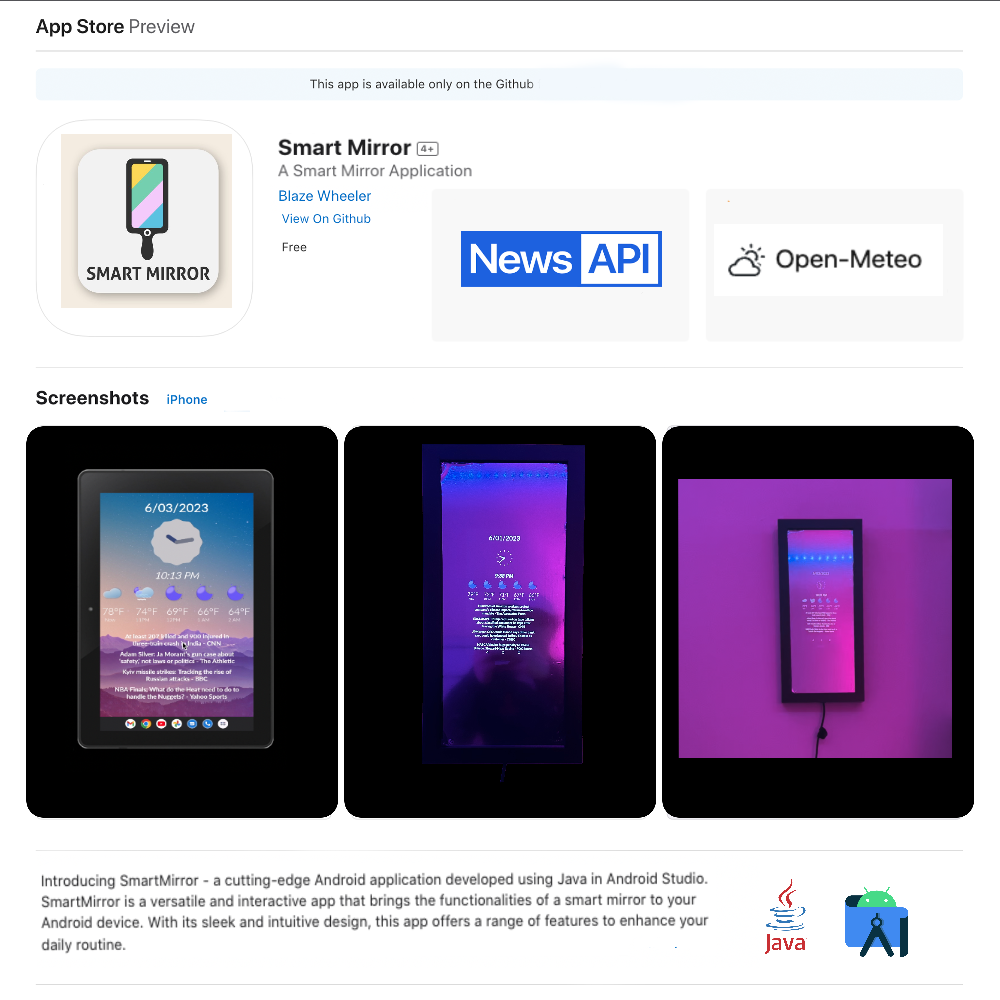

<!-- Improved compatibility of back to top link: See: https://github.com/othneildrew/Best-README-Template/pull/73 -->
<a name="readme-top"></a>


<!-- PROJECT SHIELDS -->
<!--
*** I'm using markdown "reference style" links for readability.
*** Reference links are enclosed in brackets [ ] instead of parentheses ( ).
*** See the bottom of this document for the declaration of the reference variables
*** for contributors-url, forks-url, etc. This is an optional, concise syntax you may use.
*** https://www.markdownguide.org/basic-syntax/#reference-style-links
-->
[![Apple-Silicon-Shield]][Apple-Silicon-Shield-url]
[![MIT License][license-shield]][license-url]
[![Apple License][Apple-License]][Apple-License-url]

[![LinkedIn][linkedin-shield]][linkedin-url]
[![GitHub][GitHub-shield]][GitHub-url]


<!-- PROJECT LOGO -->
<br />
<div align="center">
  <a href="https://github.com/BlazeWheeler/Android-Projects/">
    
  </a>

  <h3 align="center">Smart Mirror</h3>

  <p align="center">
   A Great Alternative To Expensive Smart Mirrors
    <br />
    </div>


<!-- ABOUT THE PROJECT -->
## About The Project


Welcome to Smart Mirror!

Android application developed using Java in Android Studio. SmartMirror is a versatile and interactive app that brings the functionalities of a smart mirror to your Android device. With its sleek and intuitive design, this app offers a range of features to enhance your daily routine.





<p align="right">(<a href="#readme-top">back to top</a>)</p>


### Built With

This Application is built natively with Java & Android Studio

* [![MacOs][MacOs]][MacOS-url]
* [![Android-Studio][Android-Studio]][Android-Studio-url]
* [![Java][Java]][Java-url]
* [![JSON][JSON]][JSON-url]

<p align="right">(<a href="#readme-top">back to top</a>)</p>


<!-- GETTING STARTED -->
## Getting Started / Installation

Getting started is fairly simple...

### Prerequisites


* Install Android Studio
* Configure Weather Api: [Open-Meto](https://open-meteo.com/) 
* Generate NewsAPI Key: [NewsAPI](https://newsapi.org/) 
* Download repository 
* Enter longitude and  latitude 
  ```sh
	double latitude = ;
    double longitude = ;

  ```
* Enter auth token
 ```sh
   private void updateNews() {
   	String apiKey = "xxxxxxxxxxxx";
   }

  ```

* Build, Run, & Have Fun!


<!-- ROADMAP -->
## Roadmap

- [x] Create UI
- [x] Add Weather API
- [x] Add News API
- [ ] Add Smart Light Contorls

 


<!-- LICENSE -->


# Released Under MIT License

Copyright (c) 2023 Blaze Wheeler,

Permission is hereby granted, free of charge, to any person
obtaining a copy of this software and associated documentation
files (the "Software"), to deal in the Software without
restriction, including without limitation the rights to use,
copy, modify, merge, publish, distribute, sublicense, and/or sell
copies of the Software, and to permit persons to whom the
Software is furnished to do so, subject to the following
conditions:

The above copyright notice and this permission notice shall be
included in all copies or substantial portions of the Software.

THE SOFTWARE IS PROVIDED "AS IS", WITHOUT WARRANTY OF ANY KIND,
EXPRESS OR IMPLIED, INCLUDING BUT NOT LIMITED TO THE WARRANTIES
OF MERCHANTABILITY, FITNESS FOR A PARTICULAR PURPOSE AND
NONINFRINGEMENT. IN NO EVENT SHALL THE AUTHORS OR COPYRIGHT
HOLDERS BE LIABLE FOR ANY CLAIM, DAMAGES OR OTHER LIABILITY,
WHETHER IN AN ACTION OF CONTRACT, TORT OR OTHERWISE, ARISING
FROM, OUT OF OR IN CONNECTION WITH THE SOFTWARE OR THE USE OR
OTHER DEALINGS IN THE SOFTWARE.
<p align="right">(<a href="#readme-top">back to top</a>)</p>


<!-- CONTACT -->
## Contact

Blaze Wheeler - [@blazew](https://www.instagram.com/blazew/) - wheelerb2@duq.edu


<p align="right">(<a href="#readme-top">back to top</a>)</p>


<!-- MARKDOWN LINKS & IMAGES -->
<!-- https://www.markdownguide.org/basic-syntax/#reference-style-links -->


[Apple-License]: https://img.shields.io/badge/LICENSE-ASPL-999999?style=for-the-badge&logo=apple&logoColor=white
[Apple-License-url]: https://opensource.apple.com/apsl/
[Apple-Silicon-Shield]: https://img.shields.io/badge/Apple-Silicon_M2-999999?style=for-the-badge&logo=apple&logoColor=white
[Apple-Silicon-Shield-url]: https://support.apple.com/en-us/HT211814

[license-shield]: https://img.shields.io/github/license/othneildrew/Best-README-Template.svg?style=for-the-badge
[license-url]: https://www.mit.edu/~amini/LICENSE.md
[linkedin-shield]: https://img.shields.io/badge/-LinkedIn-black.svg?style=for-the-badge&logo=linkedin&colorB=555

[linkedin-url]:https://www.linkedin.com/in/blaze-wheeler-8306a2223/
[GitHub-shield]: 	https://img.shields.io/badge/GitHub-100000?style=for-the-badge&logo=github&logoColor=white
[GitHub-url]: https://github.com/blazeWheeler
[product-screenshot]: images/screenshot.png
[MacOs]:https://img.shields.io/badge/mac%20os-000000?style=for-the-badge&logo=apple&logoColor=white
[MacOs-url]: https://www.apple.com/macos/ventura/
[Java]: https://img.shields.io/badge/java-%23ED8B00.svg?style=for-the-badge&logo=openjdk&logoColor=white
[Java-url]: https://www.oracle.com/java/technologies/downloads/


[MacOs-url]: https://www.apple.com/macos/ventura/
[JSON]: https://img.shields.io/badge/json-5E5C5C?style=for-the-badge&logo=json&logoColor=white
[JSON-url]: https://www.json.org/json-en.html

[Android-Studio]:https://img.shields.io/badge/Android%20Studio-3DDC84.svg?style=for-the-badge&logo=Android-Studio&logoColor=white

[Android-Studio-url]:https://developer.android.com/studio

